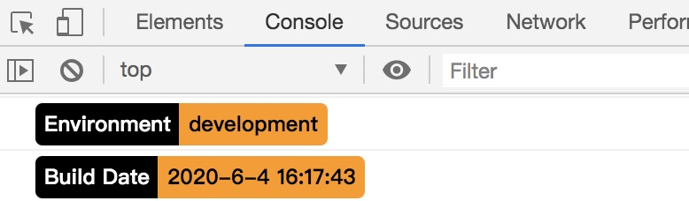

### 自动console.log编译信息，如date，NODE_ENV及其他自定义

+ 安装依赖
```
 npm install log-info-webpack-plugin -D
 yarn add log-info-webpack-plugin -D
```

+ vue.config.js配置使用
```javascript
const { LogInfoPlugin } = require('log-info-webpack-plugin')


chainWebpack: config => {
  config
    .plugin('LogInfoPlugin')
    .use(LogInfoPlugin, [{
      key1:'value1', //可选,如“version”版本号，根据key/value打印
      key2:'value2', //可选,如“version”版本号，根据key/value打印
      // ...  more
    }])
}
```

或者 

```javascript
const { LogInfoPlugin } = require('log-info-webpack-plugin')

{
  // ... config settings here ...
  plugins: [
    new LogInfoPlugin({
      key1:'value1', //可选,如“version”版本号，根据key/value打印
      key2:'value2', //可选,如“version”版本号，根据key/value打印
      // ...  more
    })
  ]
};
```

+ vite配置使用

vite.config.js
插件使用了 Vite 特有的插件钩子 transformIndexHtml 不支持Rollup

```javascript
import { logInfoVitePlugin } from 'log-info-webpack-plugin'

export default defineConfig({
  plugins: [
    react(),
    logInfoVitePlugin({
      key1:'value1', //可选,如“version”版本号，根据key/value打印
      key2:'value2', //可选,如“version”版本号，根据key/value打印
      // ...  more
    })
  ]
})
```

+ 使用效果



